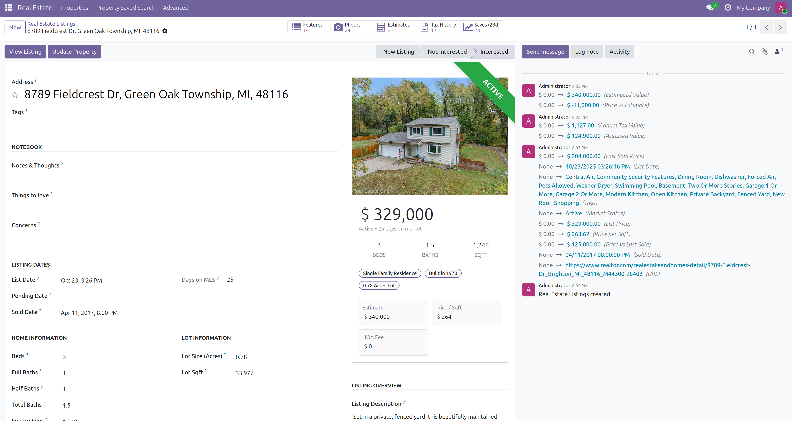

  

# 🏡 Listing Lab 🧪

A simple, friendly place to keep track of homes you’re looking at. Save listings, add notes, tag photos, and share the
short list with the people who matter. Listing Lab also keeps an eye on changes—like price cuts and status updates—so
your view of a property stays current without constant refreshing.

Under the hood, this repo includes the Listing Lab Odoo addon, a small scraper service, and a Docker Compose setup to
run everything locally.

## Highlights

- 🏠 Property listing management inside Odoo
- 🗂️ Save, tag, and organize the homes you’re considering
- 🖼️ Photo management with simple tagging
- 📈 Popularity tracking when available
- 🏡 Realtor.com data via HomeHarvest (v0.7.0+)
- 📨 Background scraping powered by RabbitMQ
- 🤖 Optional ChatGPT/OpenAI analysis (bring your own API key)

## What you can do

- Keep a list of properties you care about
- Add notes, tags, and photos to remember what stood out
- See popularity hints when available (views, saves, clicks)
- Pull fresh details from Realtor.com so your info doesn’t go stale

To scrape a property, simply copy the address into the Address field, and click "Update Property"

### Check out our open-source Odoo Docker image

Are you looking to make apps like this easily?

Adomi's Odoo Docker container makes developing and running Odoo
applications fun and easy.

### [Read more about our Odoo docker image](https://github.com/adomi-io/odoo).

# Getting started

### Docker

This application is made to run via Docker.

You can download Docker Desktop if you are on Windows or Mac

#### [Download Docker Desktop](https://www.docker.com/products/docker-desktop/)

### Configure your instance

Copy environment variables

Copy the `.env.example` file to `.env`

You can run the following command:

`cp .env.example .env`

### Run the application

Run the application by running

`docker compose up`

If you want to run run the application all the time, start it with

`docker compose up -d`

To stop the application, run

`docker compose down`

### Open the application

##### Listing Lab

The web version will be accessible at:

http://localhost:8069

By default, the login is:

| Field    | Value |
|----------|-------|
| Username | admin |
| Password | admin |

##### RabbitMQ

http://localhost:15672

By default, the login is:

| Field    | Value |
|----------|-------|
| Username | admin |
| Password | admin |

### Configure the scraper

After you have started the scraper, you will need to generate an API key and set it in the
`.env` file with the key `ODOO_API_KEY`.

#### Generate an Odoo API Key

Open the application by visiting:

http://localhost:8069

Select your user profile in the top right corner, and select My Preferences.

Click the "Security" tab, and generate a new API key.

If you are prompted for a password, enter the password you used to login (`admin` by default)

Add a persisistent key, and click "Save".

Copy the generated key and paste it into the `.env` file as the value for `ODOO_API_KEY`.

Restart the scraper by hitting `CRTL+C` or running `docker compose down` and `docker compose up`

You will see a message in the console that indicates the scraper is running successfully.

## Environment variables (quick reference)

| Variable             | Default                 | Notes                                                          |
|----------------------|-------------------------|----------------------------------------------------------------|
| ODOO_API_KEY         | —                       | You must generate an API key after you started the web service |
| ODOO_DB_HOST         | listing_lab_postgres    |                                                                |
| ODOO_DB_PORT         | 5432                    |                                                                |
| ODOO_DB_USER         | listing_lab_user        |                                                                |
| ODOO_DB_PASSWORD     | listing_lab_password    |                                                                |
| ODOO_DB_NAME         | listing_lab             |                                                                |
| ODOO_LOG_LEVEL       | info                    |                                                                |
| RABBITMQ_HOST        | rabbitmq                |                                                                |
| RABBITMQ_PORT        | 5672                    |                                                                |
| RABBITMQ_USER        | guest                   | Default management user                                        |
| RABBITMQ_PASS        | guest                   | Default management password                                    |
| RABBITMQ_QUEUE       | property_scrape_queue   |                                                                |
| RABBITMQ_EXCHANGE    | property_exchange       |                                                                |
| RABBITMQ_ROUTING_KEY | property.scrape         |                                                                |
| ODOO_URL             | http://listing_lab:8069 |                                                                |
| ODOO_DB_NAME         | listing_lab             |                                                                |

## Typical data flow

1) User requests property, and sets an address. They click "Update Property"
2) A message is published to RabbitMQ
3) The scraper consumes, calls HomeHarvest, and transforms results
4) Records are created/updated in Odoo
5) Odoo UI uses live record data and reflects the latest photos, popularity, and details

## About Adomi

Listing Lab is an Adomi project. We build helpful tools on Odoo. This one is made for individuals and families first. If
you have ideas or run into issues, feel free to open an issue or suggestion.
